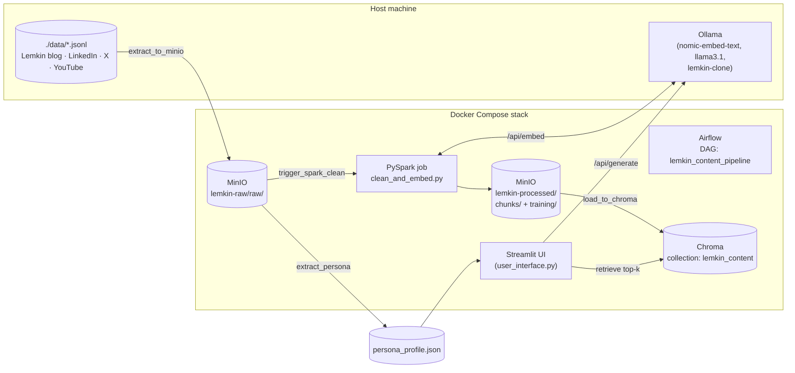

# Persona-Cloning ETL + RAG + Fine-Tuning Pipeline — Full Project Explainer

> Repo: `298P` (SJSU **DATA 298** master's project). Authors: **andreahcruz**, **Kevin Gao**.
> Persona subject: **Jason Lemkin** (SaaStr founder/CEO) — a B2B SaaS operator voice cloned from his blog, LinkedIn, X, and YouTube content.

This document explains, at full technical depth: what the system does, how every
component fits together, the exact methods used (RAG, QLoRA, evaluation), the
technology stack, and the chronological history of how the project got here
(reconstructed from `git log` across all branches, not just the checked-out one).

---

## 1. What this project actually is

A **content-generation system that writes new B2B SaaS content "in the style of"
a specific real person**, given only a corpus of that person's existing writing —
no manual style guide, no prompt-engineered persona description written by hand.

Two independent generation strategies were built and evaluated against each other:

1. **RAG (Retrieval-Augmented Generation)** — a frozen, generic LLM (Ollama
   `llama3.1`) is fed retrieved excerpts from the person's real corpus plus a
   statistically-derived "persona profile" at inference time. No model weights
   change. This is the pipeline the Docker stack runs by default.
2. **Fine-tuning** — the model's weights themselves are adapted to the corpus,
   via two competing techniques explored on separate branches:
   - **QLoRA** (local, on-host GPU, open-weight Llama 3.1 8B) — the branch
     this repository is currently checked out on (`QLoRAFT`).
   - **OpenAI supervised fine-tuning** (`gpt-4.1-nano`, cloud API) — a
     lighter-weight alternative explored on the `openaift` branch.

A third subsystem (`metricsft` branch) builds an **offline evaluation harness**
(no paid LLM judge required) to score outputs from either strategy on
rubric-adherence and retrieval-groundedness.

The whole thing is framed as a **pipeline engineering exercise**: the emphasis
(and the DATA 298 grading rubric embedded in `docs/DATA298_PRESENTATION_NOTEBOOK.ipynb`)
is on Data Process → Collection → Pre-processing → Transformation → Preparation →
Statistics → Pipeline Demo, i.e. this is as much an **ETL/orchestration project**
as it is an NLP project.

---

## 2. Repository / branch map (this matters — read before browsing code)

This repo is **not a single linear project** — it is several experiments living
on parallel branches, because different team members raced different fine-tuning
approaches at the same time. The GitHub default branch (and what a fresh
`git clone` checks out) is **`QLoRAFT`**.

```
master          d2dd81a  Initial commit: PG-style content generator (RAG + Ollama + Streamlit)
  │
  ├─ scrapers        (X/Twitter + YouTube scraper scripts; 92fc87e tip)
  │
  ├─ etlpipeline      efb9ca3 Add ETL pipeline: Airflow, Spark, MinIO, Chroma, Docker Compose
  │                   f933091 Add README
  │        │
  │        ▼ (merged into main line)
  │
  ▼
bc57596 Initial import of persona pipeline project
af0c83d Merge remote etlpipeline branch and reconcile deps
dcbe155 Switch persona from patio11 (Patrick McKenzie) → Jason Lemkin (SaaStr)   ◄── persona pivot
79bd2f7 → 91cd18b → f730750 → c19bc61 → 0aaee52  "BASIC PIPELINE DONE FOR NOW"    ◄── working ETL+RAG+Streamlit
657ee7e Data Notebook v1  (docs/DATA298_PRESENTATION_NOTEBOOK.ipynb)
  │
  ├────────────────────────────┬───────────────────────────────┐
  ▼                             ▼                               ▼
QLoRAFT (default/HEAD)       openaift                        etl_jasonl
a60785a saved FT             6d1d9ef Add OpenAI                0cc0f31 misc changes
9bafbda Before try 2                 fine-tuning workflow
8570fe5 Attempt 2 (Gibberish)
7a26d4e FTv2      ──────────► FTv2 branch tip
40567e3 Working non-gibberish qloraFT
7219f57 added initial metrics
  │
  ├──────────────────────────────┐
  ▼                               ▼
0990c93 "FT"  (QLoRAFT tip,   f74402b Add gold eval metrics
 = current HEAD of this clone)      tooling and results (metricsft tip)
```

| Branch | Tip commit | What it contains |
|---|---|---|
| `master` | `d2dd81a` | Original single-file "PG-style" (Paul Graham) RAG generator — the seed the whole project grew from. |
| `scrapers` | `92fc87e` | Node/Playwright-style scrapers for X (Twitter) timelines and YouTube transcript collection. |
| `etlpipeline` | `dcbe155` | First Dockerized ETL stack (Airflow + Spark + MinIO + Chroma) + the persona swap from `patio11` to Jason Lemkin. |
| `etl_jasonl` | `0cc0f31` | Minor fixes on top of the JSONL-based ETL. |
| **`QLoRAFT`** | **`0990c93`** (**this checkout**) | Everything above **plus** the full local QLoRA fine-tuning subsystem (`host_finetune/`), dataset cleaning v2, and Spark training-set export. |
| `FTv1` / `FTv2` | `8570fe5` / `7a26d4e` | Intermediate, now-superseded QLoRA attempts (kept for history — `FTv1` is the "gibberish" failure state). |
| `openaift` | `6d1d9ef` | Parallel OpenAI-hosted fine-tuning path (`openai_ft/`), independent of the GPU/Unsloth stack. |
| `metricsft` | `f74402b` | Offline gold-rubric + retrieval-grounding evaluation harness and its numeric results. |

**Practical implication:** if you only look at the `QLoRAFT` branch (what's on
disk right now), you will **not** see `openai_ft/` or the gold-eval JSON results
— those files exist on `openaift` / `metricsft` respectively. This overview
describes all of it since it was retrieved from full git history.

---

## 3. High-level architecture (the RAG + ETL production path)



### 3.1 Ingestion — `extract_to_minio` (Airflow task, `dags/lemkin_pipeline_dag.py`)
Reads 5 hand-scraped JSONL files from `./data` (mounted into the Airflow
container), applies a **per-source normalizer** (different schema for blog vs.
LinkedIn vs. X vs. two separate YouTube channels), and writes one normalized
JSON object per record to MinIO under `lemkin-raw/raw/`. Filtering happens here:
X replies/reposts and sub-25-character stubs are dropped; empty-transcript
YouTube rows are dropped.

### 3.2 Transform + embed — `trigger_spark_clean` (`spark_jobs/clean_and_embed.py`)
A PySpark job (submitted via Airflow's `SparkSubmitOperator`, running in
`local[*]` mode inside the Airflow container to avoid Spark driver/worker JAR
version mismatches) that:
1. Reads all raw JSON from MinIO via the **S3A Hadoop connector**
   (`hadoop-aws` + AWS SDK bundle pulled from Maven at submit time).
2. Strips HTML (`BeautifulSoup`) and scrubs newsletter/footer noise
   (`corpus_footer_scrub.py` — regex removal of "Related Posts" blocks, tweet
   embeds, etc.).
3. Parses heterogeneous date formats into a real timestamp.
4. Deduplicates on `(source, title, url, text)`.
5. **Branches the DataFrame in two directions:**
   - **RAG-chunk grain**: splits each document into ~500-word chunks
     (`chunk_text`), and for each chunk calls **Ollama's `/api/embed`**
     (`nomic-embed-text`) over plain HTTP from inside the Spark UDF, with
     retry/backoff and a tunable `SPARK_EMBED_PARTITIONS` knob (Spark
     partition count == max concurrent embed HTTP calls — set to 1 for a
     single Ollama instance on a laptop, higher for a beefier host). Output
     written to `lemkin-processed/chunks/`.
   - **SFT training grain**: kept at **whole-document granularity** (not
     500-word chunks) because "narrative arc" style-transfer signal is lost
     in RAG-sized chunks. Each document is turned into one or more
     **Alpaca-format** `{"instruction", "input", "output"}` JSON lines via
     `to_training_json_lines`, with long documents split on paragraph
     boundaries into ≤`SFT_CHUNK_OUTPUT_CHARS` (default 1600 chars ≈ Llama's
     512-token `MAX_SEQ_LENGTH`) pieces, each labeled `"(part i of n)"`.
     Written to `lemkin-processed/training/dataset_jsonl/` (single part file
     via `coalesce(1)`).

### 3.3 Load — `load_to_chroma`
Reads the chunk JSON back from MinIO, and **upserts into Chroma** (HTTP client,
`chromadb.HttpClient`, tenant/database defaults) in batches of 100, skipping
any row whose embedding failed. Document IDs are deterministic
(`{source}_{essay_id}_{chunk_index}`) so re-runs are idempotent.

### 3.4 Persona extraction — `extract_persona` (parallel to Spark)
A **pure-statistics, no-LLM** persona fingerprint built with NLTK:
top-50 content words (stopword-filtered), most common 2-word sentence
openers, a hand-authored list of "framing phrases" ("the thing is", "here's
what", "at the end of the day", …) counted by substring frequency, and top
unigrams/bigrams as "themes." Written to both MinIO
(`lemkin-processed/persona_profile.json`) and the host `./data/persona_profile.json`
for Streamlit. This profile is injected as a text block into every generation
prompt (`generate.py::summarize_persona`) — it's the cheapest possible "style
prior" and works entirely offline.

### 3.5 `mark_training_ready`
Promotes Spark's `training/dataset_jsonl/part-*.txt` output to a single
stable key `training/dataset.jsonl` plus a `_READY` sentinel JSON (timestamp,
row/byte counts). This decouples **when Spark finishes** from **when the
host-side fine-tune watcher should react** — the watcher polls the sentinel,
not the DAG.

### 3.6 Generation — `generate.py` / `user_interface.py` (Streamlit)
Given `--format`, `--topic`, `--audience`, `--goal`, `--cta`:
1. Embed the query (topic + goal + audience) with `nomic-embed-text`.
2. Retrieve top-`k` chunks from Chroma.
3. Build one composite prompt = persona summary + format spec (from
   `formats/format_specs.yaml` — per-format word-count targets, required
   structure, banned phrases) + content brief + retrieved context, with an
   explicit instruction not to copy retrieved text verbatim.
4. Call Ollama `/api/generate` against whichever model is selected —
   stock `llama3.1`, or the fine-tuned `lemkin-clone`.
5. The **instruction prefix is deliberately identical** between the RAG
   prompt and the SFT training format (`"Write in the style of Jason Lemkin
   about: {topic}"`) so that a fine-tuned model and the base model can be
   swapped behind the same UI with no prompt-format mismatch.

Four output formats are supported end-to-end: `linkedin_post`, `blog_draft`,
`x_thread`, `youtube_script` — each with its own word-count band and required
structure enforced only through the prompt (no output-side validator).

---

## 4. Fine-tuning subsystem #1 — Local QLoRA (`host_finetune/`, this branch)

This is the most engineering-heavy part of the repo, developed entirely on the
host GPU (RTX 5070 Ti, 16 GB, Blackwell architecture) **outside Docker**
because Docker Desktop on Windows can't pass through CUDA well enough for
training.

### 4.1 Method
- **Base model**: `unsloth/Meta-Llama-3.1-8B-Instruct-bnb-4bit` (pre-quantized
  4-bit NF4 weights via bitsandbytes, loaded through **Unsloth** for its fused
  kernels and 2–5× training speedup over vanilla HF/PEFT).
- **QLoRA** (Dettmers et al.): the 8B base stays **frozen in 4-bit**; a small
  set of **LoRA adapter matrices** (rank `r=16`, `alpha=32`, dropout `0`) are
  injected into `q/k/v/o_proj` and `gate/up/down_proj` and are the *only*
  trainable parameters — this is what prevents catastrophic forgetting and
  keeps VRAM low enough to fit an 8B model's fine-tune on a 16 GB consumer card.
- **Explicit `BitsAndBytesConfig`**: NF4 quant type + double quantization +
  bf16 compute dtype, rather than relying on Unsloth's implicit default —
  added so the quantization recipe is reproducible and inspectable.
- **Chat formatting**: training rows (Alpaca `{instruction, input, output}`)
  are rendered through the tokenizer's own **Llama-3 Instruct chat template**
  (`apply_chat_template`), not a raw `### Instruction:` string — this matters
  because inference through Ollama also uses the Llama-3 chat template
  (mirrored by hand in `host_finetune/Modelfile`'s `TEMPLATE` block), so
  train/serve format has to match exactly or the model degrades.
- **Assistant-only loss**: `unsloth.chat_templates.train_on_responses_only`
  masks the loss on the user/system turn tokens so the model is only
  penalized for its own (Lemkin-style) continuation, not for reproducing the
  instruction back.
- **Optimizer**: `paged_adamw_8bit` (8-bit Adam state, pages to CPU under
  memory pressure) — chosen over full-precision Adam purely for the 16 GB
  VRAM budget.
- **Sequence length**: `MAX_SEQ_LENGTH=512`, deliberately short, paired with
  the 1600-char SFT chunking upstream in Spark — a joint design constraint
  (same ratio, ~3.1 chars/token) so training rows aren't silently truncated.
- Effective batch size 16 (`per_device_batch=2 × grad_accum=8`), 1–3 epochs,
  cosine LR schedule, warmup 3%, `eval_loss`-based best-checkpoint selection.
- **VRAM safety engineering** (Windows-specific pain, documented at length in
  the code): a hard cap at 93% of physical VRAM
  (`torch.cuda.set_per_process_memory_fraction`) to force a clean OOM instead
  of a silent 5–10× slowdown from Windows paging into shared system memory;
  `PYTORCH_CUDA_ALLOC_CONF` tuned for fragmentation; Unsloth's fused
  cross-entropy explicitly capped via `UNSLOTH_CE_LOSS_TARGET_GB` because its
  auto-tuner misreads free VRAM on Windows when 8B weights are already resident.

### 4.2 Post-training: merge + GGUF export (`merge_and_export.py`)
This is where the project hit — and diagnosed — its hardest bug, documented in
`host_finetune/diagnose_pipeline.py` and the module docstring of
`merge_and_export.py`:

> **Bug**: On torch 2.10 + cu128 + a Blackwell GPU, bitsandbytes' compiled C++
> extension fails to load, silently falling back to a **numerically incorrect**
> pure-Python dequantization path. Unsloth's built-in `save_pretrained_gguf`
> calls exactly this dequant path when merging the LoRA adapter back into the
> 4-bit base, so the exported GGUF *looks* healthy (no NaNs, plausible weight
> statistics) but **generates pure token garbage** at inference. Training
> itself is unaffected because the CUDA matmul kernel used during training is
> a different code path from the dequant-for-merge code path.

> **Fix**: bypass bitsandbytes entirely for the merge step. Load the
> **un-quantized** bf16 base model (`Meta-Llama-3.1-8B-Instruct`, no `-bnb-4bit`
> suffix), apply the LoRA adapter with plain `peft.PeftModel` +
> `merge_and_unload()` (no quantization involved), save bf16 safetensors, then
> shell out directly to **llama.cpp**'s own `convert_hf_to_gguf.py` and
> `llama-quantize` binary (bypassing Unsloth's wrapper) to produce the final
> `Q4_K_M` GGUF.

`diagnose_pipeline.py` implements a 4-stage decision matrix (base bnb-4bit →
base+LoRA unmerged → merged HF → merged GGUF) specifically to bisect which
stage introduces the corruption — a genuinely rigorous debugging methodology,
not a guess-and-check fix.

### 4.3 Serving (`register_ollama.py` + `Modelfile`)
The final GGUF is registered with the local Ollama daemon as a custom model
named **`lemkin-clone`** via `ollama create -f Modelfile`, with the
`Modelfile`'s `TEMPLATE` hand-written to reproduce Llama 3.1's exact chat
control tokens (`<|begin_of_text|>`, `<|start_header_id|>`, fixed
"Cutting Knowledge Date" system block, `<|eot_id|>` stop token) — this has to
stay byte-identical to what `apply_chat_template` produced during training, or
train/serve skew degrades output quality. Once registered, it's just another
entry in Streamlit's "Generate model" dropdown (populated live from Ollama's
`/api/tags`) — RAG retrieval is unchanged; only the generator LLM differs.

### 4.4 Orchestration (`watcher.py`)
A host-side polling daemon (`python -m host_finetune.watcher`) that watches
MinIO's `training/_READY` sentinel (written by the Airflow `mark_training_ready`
task) and, on a new sentinel, chains: download dataset → clean/chunk → `finetune`
→ `merge_and_export` → `register_ollama`, fully automating "Airflow DAG
finishes" → "new fine-tuned model live in Ollama" with **no human step**
except triggering the DAG. `--once` / `--force` flags support cron-style or
manual-retrain usage.

### 4.5 Dataset hygiene iterations (`clean_dataset.py` → `clean_dataset_v2.py`)
The commit history (`Before try 2` → `Attempt 2 Model (Gibberish)` → `FTv2` →
`Working non-gibberish qloraFT`) shows this was **not** a one-shot success.
`clean_dataset_v2.py` is a much more aggressive second pass, written after the
first fine-tune produced gibberish, that:
- Reconstructs original document bodies by re-stitching the `"(part k of N)"`
  chunks Spark split earlier (chunk boundaries were cutting mid-word).
- Drops **echo-bug** rows where the instruction title leaked verbatim into the
  output (a training artifact that teaches the model to repeat prompts).
- Drops guest-speaker / podcast-intro openers and sponsor reads that aren't
  actually in Jason Lemkin's voice (SaaStr YouTube transcripts feature guests).
- Filters non-Latin-script-heavy rows, strips URLs and filler interjections
  (`um`, `uh`, `erm`…).
- Runs a **repunctuation pass** (`repunctuate.py`) on caption-derived
  transcript text that has no capitalization or punctuation at all.
- Dedupes exact-output rows.

This cleaning history matters pedagogically: the "gibberish" failure mode was
*not* the bitsandbytes merge bug described in §4.2 (that came later and was a
separate root cause) — the earlier gibberish was traced to noisy, un-scrubbed
transcript data being trained on directly.

---

## 5. Fine-tuning subsystem #2 — OpenAI hosted fine-tuning (`openaift` branch)

A lighter, cloud-hosted alternative that needed no GPU, built as
`openai_ft/prepare_nano_dataset.py` + `openai_ft/run_fine_tune.py`:

- **Scope-limited on purpose**: uses **blog posts only** (the cleanest,
  longest-form source) rather than the full multi-source corpus.
- Re-**reuses** the exact RAG prompt builder from `generate.py`
  (`build_prompt`, `load_format_spec`, `summarize_persona`) so the *user* turn
  of each training example is byte-identical to what production RAG would send
  — the difference is only that here it becomes a labeled `{system, user,
  assistant}` OpenAI chat-format training row instead of a live retrieval call.
- Context excerpts for each training row are the **document's own first ~3
  paragraphs** (not Chroma retrieval) — a cheap, offline stand-in for RAG
  context during dataset construction.
- Token-count estimation via `tiktoken` (`cl100k_base`), used to filter by
  word count and estimate training cost (constant `DEFAULT_TRAINING_RATE_PER_MILLION`
  suggests cost was tracked for the class deliverable).
- `run_fine_tune.py` uploads the resulting train/eval JSONL to the OpenAI
  Files API and creates a **supervised fine-tuning job** on **`gpt-4.1-nano`**
  (3 epochs default), via `client.fine_tuning.jobs.create(...,
  method={"type": "supervised", ...})` — the modern OpenAI fine-tuning API
  shape (not the older `training_file`-only call).
- Kept fully decoupled from the QLoRA/Unsloth stack — a genuinely independent
  A/B arm for the same underlying question ("does fine-tuning beat RAG-only,
  and does GPU-local beat cloud-hosted").

---

## 6. Evaluation subsystem (`metricsft` branch + `host_finetune/eval_rag.py`)

Two evaluation efforts exist, of increasing sophistication:

### 6.1 `host_finetune/eval_rag.py` — full harness (LLM-judge based)
For each row of a hand-written eval set, generates with **every model under
test** through the identical RAG prompt path used in production, then scores:
- **G-Eval-style rubric** via an Ollama LLM-as-judge, anchored on the corpus
  persona profile and real excerpt samples.
- **BERTScore** against a sample of genuine Lemkin outputs.
- **BLEU** and **ROUGE-L** against the same reference sample.
- **Style-consistency classifier**: a TF-IDF + Logistic Regression
  "authorship" classifier trained to distinguish real Lemkin text from a
  negative sample (the Blog Authorship Corpus, or a synthetic fallback if
  unreachable) — used to score how "Lemkin-like" generated text reads to a
  simple statistical model.
- **RAGAS** (`faithfulness`, `answer_relevancy`) as a best-effort extra signal
  when an LLM backend is configured — explicitly non-fatal if unavailable.

### 6.2 `host_finetune/eval_gold_rag.py` — offline gold-rubric harness (`metricsft`)
Built specifically to **not require a paid LLM judge**, using only rule-based /
lexical-overlap scoring against a small (10-row) hand-authored gold set
(`data/openai_ft/lemkin_gold_eval.jsonl`). Two metric families:

1. **Gold rubric**: format adherence (word count, H2 section count, list-item
   count against `format_specs.yaml`), brief alignment (lexical overlap with
   the audience/goal/topic brief), and expected-fact coverage.
2. **Retrieval grounding**: answer relevance (lexical overlap between answer
   and query), **faithfulness** and **context precision** (fraction of output
   sentences whose content is lexically supported by retrieved/reference
   context), and **context recall**.

**Actual measured results** (`gold_rag_summary.json`, 10-row baseline eval,
all `blog_draft` format):

| Metric | Score |
|---|---|
| Overall (gold rubric) | **0.66** |
| Format adherence | 0.52 |
| Brief alignment | 0.47 |
| Expected-fact coverage | 1.00 |
| Answer relevance | 0.45 |
| **Faithfulness** | **0.13** |
| Context precision | 0.13 |
| Context recall | 1.00 |

The standout finding is the **low faithfulness/context-precision (~0.13)**
despite **perfect context recall (1.0)** — i.e., the retriever reliably pulls
in a chunk containing the needed information, but the generator's output
sentences are only lexically traceable back to that retrieved context about
13% of the time. In plain terms: **retrieval works; grounded, low-hallucination
generation is the weaker link** — a legitimate, reportable pipeline-evaluation
finding for the DATA 298 deliverable, not just a "the metrics are low" caveat.

---

## 7. Technology stack

### 7.1 Orchestration & infra
| Component | Version / image | Role |
|---|---|---|
| **Docker Compose** | v3.8 schema | Single-command reproducible stack (9 services) |
| **Apache Airflow** | `2.8.1`, Python 3.10 image, `LocalExecutor` | DAG scheduling (`lemkin_content_pipeline`) |
| **PostgreSQL** | `postgres:15` | Airflow metadata DB |
| **MinIO** | `minio/minio:latest` | S3-compatible object store — 2 buckets: `lemkin-raw`, `lemkin-processed` |
| **Apache Spark** | `3.5.0` (pip PySpark inside Airflow image; Bitnami `spark:3.5` images for optional standalone cluster) | Distributed clean/chunk/embed job; runs in `local[*]` mode by default to avoid driver/worker JAR skew |
| **Hadoop AWS connector** | `hadoop-aws:3.3.4` + AWS SDK bundle `1.12.262` (via `spark.jars.packages`) | Gives PySpark's pip build S3A access to MinIO |

### 7.2 AI / ML
| Component | Role |
|---|---|
| **Ollama** (host-installed, not containerized) | Serves both the embedding model and generation models over local HTTP |
| **`nomic-embed-text`** | Embedding model for both RAG chunks and query-time retrieval |
| **`llama3.1`** | Default generation model (stock, RAG-only path) |
| **Chroma** (`chromadb/chroma:1.5.5` server image; `chromadb==1.5.5` client) | Vector database — single collection `lemkin_content`, HTTP client mode |
| **Unsloth** (`>=2026.5.0`) | Fast 4-bit LoRA fine-tuning kernels + GGUF export tooling for Llama 3 |
| **PEFT** / **TRL** (`SFTTrainer`, `SFTConfig`) | LoRA adapter injection + supervised fine-tuning loop |
| **bitsandbytes** | 4-bit NF4 quantization (training-time only — bypassed for merge, see §4.2) |
| **PyTorch** | `>=2.10.0,<2.11.0`, CUDA 12.8 build, bf16 training on an RTX 5070 Ti (Blackwell, sm_120) |
| **llama.cpp** (`convert_hf_to_gguf.py`, `llama-quantize`) | GGUF conversion + Q4_K_M quantization, invoked directly to avoid the Unsloth/bitsandbytes merge bug |
| **NLTK** | Tokenization + stopwords for the rule-based `extract_persona` statistics job |
| **spaCy, sentence-transformers, bert-score, rouge-score, RAGAS, scikit-learn** | Evaluation-harness dependencies (`requirements.txt`) |
| **OpenAI API** (`openai` SDK, `gpt-4.1-nano`) | Alternative cloud fine-tuning path (`openaift` branch only) |
| **tiktoken** | Token counting for OpenAI dataset cost/length estimation |

### 7.3 Application layer
| Component | Role |
|---|---|
| **Streamlit** (`1.29.0`) | End-user generation UI, separate minimal Docker image/requirements file from the Airflow stack to avoid a `pydantic`/`email-validator` version conflict |
| **Python** (`generate.py`) | CLI-equivalent of the Streamlit app; shared prompt-building code between both |
| **PyYAML** | `formats/format_specs.yaml` — per-format structure/length/banned-phrase specs |
| **boto3** | S3/MinIO client, used by both Airflow tasks and the host-side `host_finetune` scripts |
| **BeautifulSoup4** | HTML stripping in Spark |

### 7.4 Data collection (scrapers, `scrapers` branch)
- `scrape_transcripts.py` — Python + `yt-dlp`, targeting two YouTube channels
  (`@Jasonlk`, `@Saastr`), with keyword-based video classification (AMA,
  Workshop Wednesday, keynote, etc.).
- Node.js scraper (`scrape_x_profile.cjs`, mentioned in commit history) for X
  (Twitter) timeline export.

---

## 8. Chronological build history (every step, in order)

Reconstructed from `git log --all --graph` across every branch (dates from
commit metadata):

1. **2026-03-24 — `d2dd81a` Initial commit** — a single-file "PG-style"
   (Paul Graham) content generator: RAG + Ollama + Streamlit. This is the seed
   architecture everything else extends.
2. **Scraper phase** (`eaf2584` → `e0b30ee` → `74a1f0a` → `4e76dd1` →
   `8c6fde9` → `3758768` → `92fc87e`) — built and iterated an X/Twitter
   scraper (`scrape_x_profile.cjs`) and collected the initial `data/` JSONL
   dumps; `jasonlk_originals.jsonl` was briefly deleted and re-added during
   iteration.
3. **2026-03-24 — `f933091` / `efb9ca3`** (on `etlpipeline` branch) — added the
   first Dockerized ETL stack: Airflow + Spark + MinIO + Chroma + Compose, plus
   a setup README.
4. **2026-03-26 — `bc57596` Initial import of persona pipeline project** — a
   second, more elaborate **Airflow + DuckDB**-based pipeline
   (`persona_pipeline/`, "Phase 7" per its own docstring) with its own
   scrapers (`collect_blog.py`, `collect_lemkin_yt.py`, `collect_saastr_yt.py`),
   Spark job, persona-profile builder, ChromaDB builder, and even a LoRA
   training script (`persona_pipeline/training/finetune_lora.py`) — built as a
   local-Mac-friendly alternative (single active task, subprocess-per-step
   instead of in-process Airflow callables). **This directory is a legacy /
   parallel prototype** — the stack that Docker Compose actually runs today
   is the simpler root-level `dags/` + `spark_jobs/` pair, not
   `persona_pipeline/`.
5. **2026-03-26 — `af0c83d` Merge remote etlpipeline branch and reconcile deps**
   — unified the two parallel ETL efforts and resolved dependency conflicts.
6. **2026-03-30 — `dcbe155` Switch persona from patio11 to Jason Lemkin
   (SaaStr)** — the persona pivot: originally targeting Patrick McKenzie
   (`patio11`), switched to Jason Lemkin.
7. **2026-04-06 — `79bd2f7` → `91cd18b` → `f730750` → `c19bc61` → `0aaee52`**
   — "Current attempt 1" → "spark run success, chroma failed" → Airflow
   Dockerfile fixes → "streamlit initial run" → **"BASIC PIPELINE DONE FOR
   NOW"**: the full ETL → RAG → Streamlit loop working end-to-end for the
   first time in one day of iteration.
8. **2026-04-08 — `657ee7e` Data Notebook v1** — added
   `docs/DATA298_PRESENTATION_NOTEBOOK.ipynb`, a rubric-aligned notebook that
   pulls live evidence (row counts, samples, a Mermaid pipeline diagram)
   directly from the repo's data files and running Chroma instance, for the
   course deliverable.
9. **Branch split for parallel fine-tuning experiments:**
   - **QLoRA path** (`QLoRAFT`): `a60785a` saved FT → `9bafbda` Before try 2 →
     `8570fe5` **Attempt 2 Model (Gibberish)** → `7a26d4e` FTv2 →
     `40567e3` **Working non-gibberish qloraFT** → `7219f57` added initial
     metrics → **`0990c93` "FT"** (current HEAD): added `clean_dataset_v2.py`,
     `repunctuate.py`, `rebuild_chroma.py`, diagnostic/audit scripts, and the
     bitsandbytes-merge-bug fix in `eval_rag.py`/`sft_chunk_utils.py`.
   - **OpenAI path** (`openaift`): `6d1d9ef` **Add OpenAI fine-tuning
     workflow** — a from-scratch, GPU-free alternative fine-tune pipeline
     built in parallel, reusing the RAG prompt-builder code for dataset
     construction.
   - **Metrics path** (`metricsft`, branched off the QLoRA line after
     `7219f57`): `f74402b` **Add gold eval metrics tooling and results** — the
     offline gold-rubric + retrieval-grounding scorer and its numeric output
     (§6.2 above).

**Net effect**: the project moved from *"one script that RAGs against a local
Chroma index"* → *"a fully orchestrated, containerized ETL pipeline feeding a
vector store"* → *"two independent, competing fine-tuning strategies layered
on top of that same pipeline"* → *"a quantitative evaluation harness comparing
them"* — which maps almost exactly onto the DATA 298 rubric sections the
presentation notebook explicitly targets (Data Process → Collection →
Pre-processing → Transformation → Preparation → Statistics → Pipeline Demo).

---

## 9. Known failure modes documented in the code (worth knowing before you run it)

- **Chroma "default_tenant" errors** — a Docker volume from an older Chroma
  server layout persisting across a version bump; fixed by deleting the
  `chroma-data` volume and re-running `load_to_chroma`.
- **`InvalidClassException` on Spark `Task`** — pip PySpark (driver) and
  Bitnami Spark (workers) are different builds; the default `local[*]` mode
  sidesteps this entirely by never using the standalone workers.
- **Missing S3A jars** — PySpark ships without Hadoop's S3 connector; the DAG
  pulls `hadoop-aws` + AWS SDK from Maven at submit time (needs outbound
  internet on first run).
- **`posthog` typing crash under Python 3.8** — forced the Airflow image to
  `apache/airflow:2.8.1-python3.10` specifically so `chromadb`'s `posthog`
  telemetry dependency's `dict[str, ...]` type hints don't raise `TypeError`.
- **The GGUF-garbage bug** (§4.2) — the single most significant debugging
  effort in the repo; root-caused to a broken bitsandbytes CUDA extension on
  Blackwell GPUs silently falling back to incorrect Python-side dequantization
  during LoRA merge.
- **Windows VRAM-fraction OOM design** — deliberately fails fast (clean OOM)
  rather than allowing Windows to page an overflowing allocator into shared
  system RAM, which would silently turn a 45-minute fine-tune into an
  8+ hour one.

---

## 10. Quick mental model (one paragraph)

Local JSONL scrapes of one person's blog/LinkedIn/X/YouTube content are
normalized and staged in MinIO by Airflow, cleaned/chunked/embedded by Spark
calling out to a local Ollama embedding model, and loaded into a Chroma vector
store; a Streamlit app (or CLI) retrieves relevant chunks at generation time
and prompts a generic LLM — RAG's "cheap" style transfer. In parallel, the
same Spark job exports whole-document instruction/response pairs that are used
to actually **fine-tune** a copy of that LLM's weights via QLoRA on a local
GPU (with a hard-won fix for a quantization-library bug that corrupted the
final exported model), producing a custom Ollama model that the same UI can
swap in. A second, independent team member built the equivalent fine-tune
using OpenAI's hosted API on `gpt-4.1-nano` instead. A rule-based evaluation
harness then scores outputs from any of these paths on rubric adherence and
retrieval-groundedness, without needing a paid LLM judge — and found that
retrieval was reliable but generation grounding (faithfulness) was the
system's weakest link.
