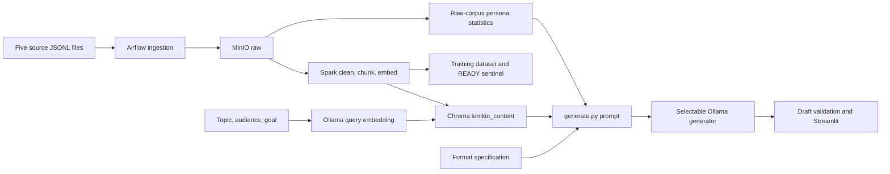

# Architecture: implementation versus proposal

2026-10-03 at ea1d58b. Paths below are IMPLEMENTED; runtime and quality claims require separate evidence.

## Compose application

Compose mounts root `dags/`, not `persona_pipeline/dags/`. DuckDB is not in this path. Root persona statistics come from `dags/lemkin_pipeline_dag.py:extract_persona`, not the separate persona-profile job. `generate.py` retrieves by topic/goal/audience embedding, without persona reranking or a split filter. One context block mixes evidence and tone; generation settings come from Ollama/model defaults.

## Host QLoRA and comparison

`data/cleaned` → SFT builder → promo filter → token fitter → grouped assignment → Unsloth/TRL assistant-only QLoRA → adapter. Optional export: bf16 CPU merge → llama.cpp GGUF → Ollama registration → selectable RAG generator.

Watcher downloads/prepares `dataset.jsonl`, but invokes training without overriding its cleaned fit512 default and EXP-002 manifest. Repaired training used explicit overrides. Historical `compare_adapters.py` runs use one-line instructions, directly loaded adapters or Ollama chat, and no RAG. As of 2026-10-04 the script can take `--retrieval` and a `repaired-vs-relabel` preset; the default remains retrieval-off, and that preset has not been run. `rebuild_chroma.py --train-only` writes collection `lemkin_train_only` under `host_finetune/output/chroma_lemkin_train_only` and refuses `lemkin_content`. That build finished on CPU during EXP-005 with 21,194 documents. Matching temperature does not remove backend/quantization confounds. The UI still generates through Ollama against `lemkin_content` unless those settings are changed.

## Separate persona implementation

`persona_pipeline/config/config.py` defines separate raw/processed/training locations, DuckDB database, profile, and persistent Chroma `lemkin_persona`. Its retrieval rewrites queries with profile topics/vocabulary, fetches 2k candidates, and reranks by vocabulary overlap. Its HF/PEFT inference ranks generated candidates. This is executable code, but not the Compose-selected path or a verified current hybrid result. It is not proven equivalent to the published PersonaRAG algorithm.

## Proposed target (DEC-003)

Immutable source → attribution/cleaning dispositions → frozen document families. Train-owned material feeds the adapter, style-exemplar pool and permitted factual index. Prompts identify style examples separately from factual evidence, with source IDs and bounded budgets. Style examples cannot justify unrelated claims.

Ontology-aware retrieval needs a versioned schema, typed relations, constraints, evidence spans, and retrieval that uses those structures. Author/Document/Topic/Entity/Claim/Stance are candidate concepts, not implemented classes. Evaluate structured questions independently of author voice; compare against vector retrieval on the same corpus.

System boundary: local research preparation, training, retrieval, draft generation and evaluation. Actors: researcher and draft reviewer. Model/tokenizer sources and optional judge services are external dependencies. Publishing and author endorsement are outside current scope; deployment and data-rights details remain open.
