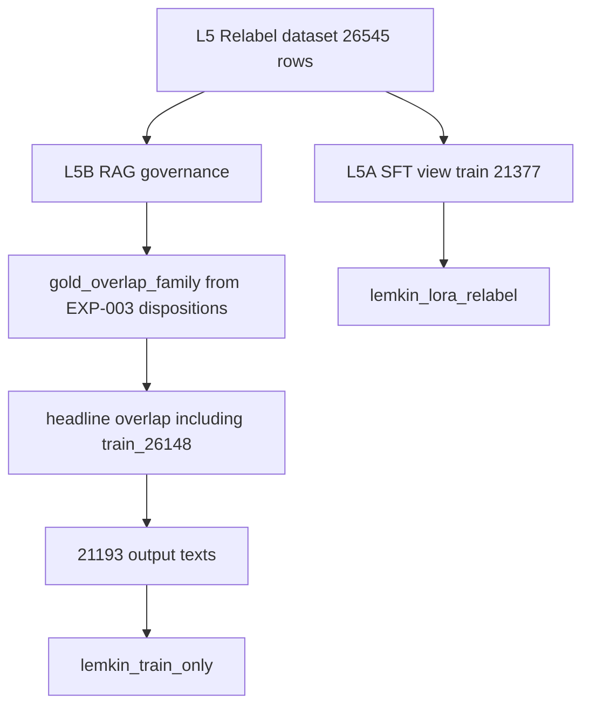

# Frozen pipeline parity contract

This contract locks the behavior that produced the Relabel adapter and Factual Dense RAG v1. It is a check against frozen files and in-memory selection. It does not rebuild datasets, embeddings, or Chroma.

The SFT view and the RAG view diverge on purpose. Gold and leakage filters belong on the RAG branch only. The adapter was trained on train rows that the index later excludes.



Run the check with either command:

```text
.venv-test\Scripts\python.exe -m pytest -q tests/test_pipeline_parity.py
.venv-test\Scripts\python.exe -m host_finetune.verify_frozen_parity
```

`host_finetune/verify_frozen_parity.py` does not import the trainer, `rebuild_chroma`, or `audit_retrieval_corpus`. It does not open the persisted collection.

## A. Relabel dataset

Source file: `experiments/EXP-20261003-004-relabel-continuations/raw/dataset.jsonl`

| Fact | Value |
|---|---|
| Total rows | 26,545 |
| Train | 21,377 |
| Validation | 2,588 |
| Test | 2,580 |
| Dataset SHA-256 | `1231835ecc5dcb608fefa0357d325affb2afbdc3aeade2a63b1dc42b2920897b` |

Counts are the `split` values on assignment rows, excluding the `record_type=meta` line. The dataset file and the assignment rows are the same length.

Builder: `host_finetune.relabel_continuations`. Targets were copied from the balanced 512-token file. Roles are `unchanged`, `opening`, and `continuation`.

## B. Split and group

Split file for the hash below: `experiments/EXP-20261003-004-relabel-continuations/raw/split_assignments.jsonl`

| Fact | Value |
|---|---|
| Split SHA-256 | `6e31aedf33bbc81488641e3a2d0d284199bd7c3e724d97d27e801a37010ea7fb` |

This is the post-relabel assignment file. It is not the EXP-008 assignment file. The inventory hash of `experiments/EXP-20261001-008-repaired-balanced-split/raw/split_assignments.jsonl` is `1e3ae21d2dd857c097b8d6816bb0941376d3f6719d142bd0f78a8c1848a8b3f6`.

`group_id` was assigned by `host_finetune.split_groups.assign_groups` on the balanced file, then copied through relabel. A group unions rows that share `source_file` plus `source_line`, the same normalized title, the same normalized output, or token Jaccard of at least 0.8. That union is split ownership. It is not the RAG leakage test.

Invariant: each `group_id` appears in only one of train, validation, and test. The frozen assignment bytes are the deterministic record. This harness does not re-run `assign_groups`, because that function was recorded from a dirty worktree.

## C. SFT view

Train-owned rows: 21,377. Validation and test are not training rows.

EXP-005 trained this view. The recorded command in `experiments/EXP-20261003-005-relabel-qlora/config/commands.txt` sets:

- `FINETUNE_DATASET` to the EXP-004 `dataset.jsonl`
- `SPLIT_MANIFEST` to the EXP-004 `split_assignments.jsonl`
- `ADAPTER_DIR` to `host_finetune/output/lemkin_lora_relabel`

The parity check reads that command text. It does not import `host_finetune.finetune` and does not load adapter weights. The trainer default in `host_finetune/config.py` still points at an older fit file. The frozen run overrode that default.

The SFT view includes the rows the RAG branch drops.

## D. RAG governance view

Source rows are the Relabel dataset, not Spark chunks and not `lemkin_content`.

Eligible rows:

- `split=train`
- non-empty `output`
- `group_id` not in `blocked_group_ids` from EXP-003 dispositions whose reasons include `gold_overlap_family`
- `group_id` not in `headline_overlap_groups` against `data/openai_ft/lemkin_gold_eval.jsonl`

The embedded field is `output`. The instruction is not the indexed text. `unchanged`, `opening`, and `continuation` rows stay eligible. Role is not a drop reason.

Selection functions, called in memory only:

1. `blocked_group_ids` then `select_train_documents`
2. that set union `headline_overlap_groups`, then `select_train_documents`

Frozen arithmetic the second call must reproduce:

| Step | Rows |
|---|---:|
| Train rows | 21,377 |
| Gold-overlap-family train rows from the first call | 183 |
| First selection | 21,194 |
| Additional removal | `train_26148` |
| Second selection | 21,193 |

21,377 minus 21,193 is 184. The two function calls have to show that split as 183 plus the one id. The expected role counts on the 21,193 rows, from the frozen corpus audit, are unchanged 11,611, opening 1,687, continuation 7,895.

Headline matching uses `normalize_overlap_text`: URL removal, unicode dash folding, punctuation folding, and whitespace collapse, then exact match, title match for topics, containment of values of at least 8 words, or token Jaccard of at least 0.80. A hit drops the whole `group_id`. This normalizer is not the split-grouping normalizer.

Every selected record carries `group_id`, `medium` (the stored `source_platform`), `row_id`, and `split`. Every `split` is `train`. Document id is `train_{row_index}`.

## E. Chroma index

Production collection name: `lemkin_train_only`.

Persisted path: `host_finetune/output/chroma_lemkin_train_only`.

Live audit status: `PERSISTED CHROMA PARITY = PASS`. The harness reads `chroma.sqlite3` with SQLite `mode=ro` and compares ids, document text, `group_id`, `medium`, `row_id`, and `split` to the in-memory selection. It does not construct a Chroma client and does not upsert. Count 21,193, `train_26148` absent, distance cosine.

Recorded file evidence, which is not a live collection pass, is `experiments/EXP-20261004-009-dense-rag-v1/metrics/corpus.json` and `config/retriever.json`: count 21,193, `train_26148_present` false, collection `lemkin_train_only`, distance cosine. `assert_collection_allowed("lemkin_content")` must refuse that name. Parity must not treat `lemkin_content` or `lemkin_persona` as the production index.

## F. Artifact hashes

Raw and cleaned identities are the SHA-256 values in `docs/data/artifact_hashes.csv` for these paths:

- `data/jasonlemkin_blog.jsonl` `8492ef11acacd767ce6bcdbdf6215467b6ba74d3e57dc50ffcd0af7deebc34a8`
- `data/jasonlemkinlinkedin.jsonl` `a2899576ac75ebb5fe05af15bdd0425eef9636de42bb058e82b9c456ae71ef09`
- `data/jasonlk_originals.jsonl` `a2021528bf4a34cd34c074d252d6bf246fddbe422033e7b88ebc0e11c74044c1`
- `data/jasonmlemkinyoutubetranscripts.jsonl` `a943eb049b79b75e6aa17073cfcd4a7431e7a163b3a4276f4f8116cc31a1e337`
- `data/saastryoutubetranscripts.jsonl` `89e4de78a7e3e947625523b27fbc29a0b75ef217f5c6e7a76d1aaca41916560d`
- `data/cleaned/jasonlemkin_blog.jsonl` `07dc0623f567ec5e05cee71b3577e62be143ddf651bec4257b9955593f2a7bab`
- `data/cleaned/jasonlemkinlinkedin.jsonl` `da4361c56f93820291fb583d3386e7a211aadaf9e66d8d0a971873a9920ccbf2`
- `data/cleaned/jasonlk_originals.jsonl` `e779f42fbb951d6ea4da9e8e35862563bd267d0fb635c2619aefb1ba593770c5`
- `data/cleaned/jasonmlemkinyoutubetranscripts.jsonl` `e13d7f0a45b4279281dd2ae4946a702b9036b4349ea90a220364d017a18e8484`
- `data/cleaned/saastryoutubetranscripts.jsonl` `b673ee254840edd2e26bfcd3f8ab88d5033ba8b9f896de73eaccafbf21024cb7`
- `data/openai_ft/lemkin_gold_eval.jsonl` `d7c4f997899e28f28eb3ea9aa3417857da6f0666acbf72fd8ac31422034e520e`

Balanced parent file, hashed in place and never rewritten:

`host_finetune/data/dataset_fit512_keepbreaks_balanced.jsonl` `6e99b414733eafdfa27a5e94dd26beff1498bbfd58af132251e24044fef4f057`

## Reproducibility gaps

These stay visible. A gap is not a license to change the frozen files.

### Balance step

Two statements stay separate.

**Transformation = reproducible (LEVEL 1).** `queue_followup_trains.select_balanced_rows` on `dataset_from_cleaned_sources_fit512_keepbreaks.jsonl` returns the frozen 31,328 rows. Policy: drop `youtube_saastr` (5,492 rows), and keep whole X documents in sorted `(source_file, source_line)` order until the X row count reaches the blog row count. Counts: parent 43,012, blog 14,315, X 14,316, SaaStr 0. Membership, order, parsed objects, and JSON key order match the frozen file.

The byte contract is explicit and platform-independent. It does not use text mode or `os.linesep`:

```text
encoded = [json.dumps(row, ensure_ascii=False).encode("utf-8") for row in selected_rows]
artifact = b"\r\n".join(encoded) + b"\r\n"
```

That artifact is UTF-8, has no BOM, and ends every record, including the last, with CRLF. Its SHA-256 is `6e99b414733eafdfa27a5e94dd26beff1498bbfd58af132251e24044fef4f057`. The LF-only construction `json.dumps(...) + "\n"` hashes to `60481f38fee42dbfa6c980e65cb7d6ce620e8f9a920f422701487f1922f7486a` and is not the historical contract.

The parity harness reports these as separate blocking passes: `balance_policy`, `balance_membership`, `balance_order`, `balance_byte_parity`.

**Invocation / historical command = unrecorded.** No committed command writes `dataset_fit512_keepbreaks_balanced.jsonl`. EXP-008's command list fits the nopromo file into the keep-breaks file, then splits the balanced file. `build_balanced` reads `dataset_from_cleaned_sources_fit512.jsonl` and writes `dataset_fit512_no_saastr_xcap.jsonl`. That gap is the non-blocking check `balance_invocation`. Reproducing the bytes does not invent the missing command.

### Final embedding build

EXP-009's recorded command is `python -m host_finetune.audit_retrieval_corpus`. That command reads the collection, embeds queries, and writes the experiment directory. It does not prove which process embedded the 21,193 documents. The 21,194 build is described in project notes as `python -m host_finetune.rebuild_chroma --train-only --batch-size 16`. No registered experiment command records the later build that left `train_26148` out.

### Dirty worktrees

Copied from manifests. The uncommitted code was not reconstructed.

| Experiment | Commit | Dirty |
|---|---|---|
| EXP-20261001-008 | `ebe5d8ebb4a9a8b5d700b45c7d50d40930c55a36` | yes |
| EXP-20261003-004 | `ea1d58b30cafcb4cf18a03ded39963f64ce6aee7` | yes |
| EXP-20261003-005 | `ea1d58b30cafcb4cf18a03ded39963f64ce6aee7` | yes |
| EXP-20261004-009 | `4006d4cee7768789c460c4c2ae1b1fcb1b124b03` | yes |

## What this contract does not claim

Passing file checks do not mean the live Chroma directory was re-counted. They do not mean embedding vectors are byte-stable across Ollama builds. Balance byte parity means the transformation and the explicit CRLF artifact are reproducible. It does not mean a historical command for that write was recorded.
