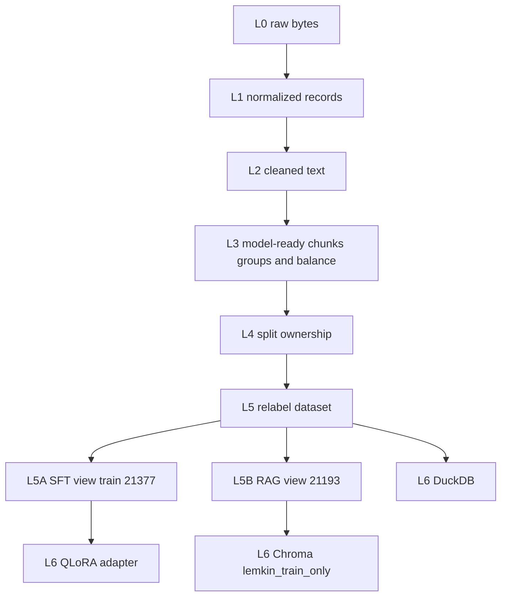

# Target layers for a reproducible Lemkin pipeline

Design only. This document does not move code. The parity contract in [PIPELINE_PARITY_CONTRACT.md](PIPELINE_PARITY_CONTRACT.md) has to keep passing before any stage below replaces the current functions.

The current frozen pair is Relabel QLoRA plus Factual Dense RAG v1. Gold and leakage exclusions stay on the RAG branch. They are not a shared pre-SFT filter. The adapter was trained on 21,377 train rows. The index contains 21,193 of those rows' `output` fields.

## Layers

**L0 raw.** The five JSONL files under `data/`, stored immutable, with file SHA-256. No rewriting. Historical Spark and MinIO copies are not a second raw definition.

**L1 normalized.** One record schema: deterministic `source_id`, medium, title, text, url, time, and reply or repost flags. Field names from the scrapes are mapped here. Text is still the raw string.

**L2 cleaned.** One call to `spark_jobs/corpus_footer_scrub.scrub_corpus_text`, which `host_finetune.clean_scraped` already uses. Drop reasons are stored. The current `data/cleaned/*.jsonl` hashes are the parity target. Spark must not grow a second scrub.

**L3 model-ready content.** In order: SFT chunking from `sft_chunk_utils`, the event-promo title filter, the keep-breaks 512-token fit, then the balance policy, then `group_id` creation. Balance is its own function with one output path. Today `select_balanced_rows` exists, and the command that wrote `dataset_fit512_keepbreaks_balanced.jsonl` does not. Grouping uses source line, normalized title, normalized output, and Jaccard 0.8. That is split ownership, not RAG leakage matching.

**L4 split ownership.** Medium-wise 80/10/10 from `split_groups`. A `group_id` stays inside one of train, validation, and test. No shuffle seed. Gold exclusion is not applied here.

**L5 relabel canonical dataset.** `relabel_continuations` copies `output` and rewrites instructions for openings and continuations. Frozen file: EXP-004 `dataset.jsonl`, 26,545 rows, SHA-256 `1231835ecc5dcb608fefa0357d325affb2afbdc3aeade2a63b1dc42b2920897b`.

**L5A SFT view.** All 21,377 train rows, including rows the index will drop. This is the input that EXP-005 trained.

**L5B RAG governance view.** Train rows only, then `blocked_group_ids`, then `headline_overlap_groups`. Result: 21,193 non-empty `output` texts, `train_26148` absent. Continuation rows remain. Metadata is `group_id`, `medium`, `row_id`, `split=train`. URL folding and punctuation folding in `normalize_overlap_text` apply only inside this match. They do not rewrite stored text and they do not regroup L4.

**L6 derived systems.** The Relabel adapter is already frozen. DuckDB, when added, reads stage files and exclusion reasons. It does not create them. Ollama `nomic-embed-text` on CPU embeds the L5B file. Chroma collection `lemkin_train_only` is derived. `lemkin_content` and `lemkin_persona` stay historical.

## Technology ownership

| Technology | Current role | Status | Target role | Should not own |
|---|---|---|---|---|
| Airflow | `lemkin_content_pipeline`: JSONL to MinIO, Spark, Chroma `lemkin_content`, training sentinel | Historical for this pair | Orchestrate L0–L6 after each stage is a single function and parity holds | Cleaning rules, split rules, gold rules, embedding math |
| PySpark | HTML strip, footer scrub, exact dedup, non-overlapping 500-word chunks, embed into `lemkin_content` | Historical for this pair | Optional runner of the canonical Python functions if a course-scale job is required | A second chunker, scrubber, or splitter |
| MinIO | Raw, chunks, and watcher training objects for the Compose path | Historical for this pair | Versioned bytes for L0–L5 files and manifests | A second dataset definition |
| DuckDB | Persona-pipeline Parquet analytics | Historical | Read-only counts, exclusion reasons, and manifest queries | Cleaning, splitting, or index builds |
| ChromaDB | `lemkin_content`, `lemkin_persona`, and frozen `lemkin_train_only` | `lemkin_train_only` is current | Derived index of L5B only | Cleaning, split ownership, or gold policy |
| Ollama | `nomic-embed-text` for Spark chunks and for the frozen index; separate generators | Embedder is current | Embed L5B with the model name, `num_gpu`, and distance recorded | Deciding which rows are eligible |
| host_finetune Python | The path that actually built the frozen SFT file and the RAG selection | Current | L1–L5 functions and the L5A/L5B formatters | A hidden second ETL beside those modules |
| Unsloth | EXP-005 training of `lemkin_lora_relabel` | Frozen | Training only, from the L5A file | Data cleaning or retrieval filtering |

Spark, Airflow, MinIO, and DuckDB did not produce the 21,377-row training view or the 21,193-row index. They stay out of the parity source of truth. They can sit in front of the canonical functions later. The corpus is tens of thousands of rows, so Spark is not required for the current volume.

## Refactor order

Each phase stops if the parity suite fails. Do not rebuild Chroma or retrain during these phases.

1. **Phase A.** Freeze this contract and `tests/test_pipeline_parity.py`. Done when the file-based checks pass and the live collection audit stays deferred while another process may be using it.
2. **Phase B.** Closed as LEVEL 1. `select_balanced_rows` plus an explicit CRLF byte contract matches `6e99b414…` for policy, membership, order, and bytes. The historical command is still unrecorded. Do not replace `dataset_fit512_keepbreaks_balanced.jsonl`.
3. **Phase C.** Design only, in `docs/data/CANONICAL_IDENTITY_SPEC.md`. Do not inject source ids or rewrite cleaned bytes until a later approved migration.
4. **Phase D.** Call the footer scrub from one module. Point `clean_scraped` at it. Leave the Spark copy unused for this corpus until it calls the same function.
5. **Phase E.** Keep `split_groups` as the only group and split implementation. Delete the production use of the Spark chunker copy in `clean_and_embed.py` only after L3 parity, not before.
6. **Phase F.** Write the L5 dataset once, then derive L5A and L5B as views. L5A stays 21,377 train rows.
7. **Phase G.** Write the L5B JSONL from `blocked_group_ids` and `headline_overlap_groups`. Hash it. Do not embed it until the id set is the 21,193 frozen ids, including the absence of `train_26148`.
8. **Phase H.** Write a manifest at every stage: git SHA, input hashes, row counts, drop reasons, and output hash.
9. **Phase I.** Put MinIO and Airflow around those stages. DuckDB reads the manifests. Airflow does not reimplement them.
10. **Phase J.** Only after the id and text parity still holds, consider a new chunking scheme as a new collection. Leave `lemkin_train_only` unchanged until that comparison is registered.

## First code change after this design

None in the production selectors. Phase B byte parity is closed. Phase C is specified and is not a migration. The balanced file stays where it is.
